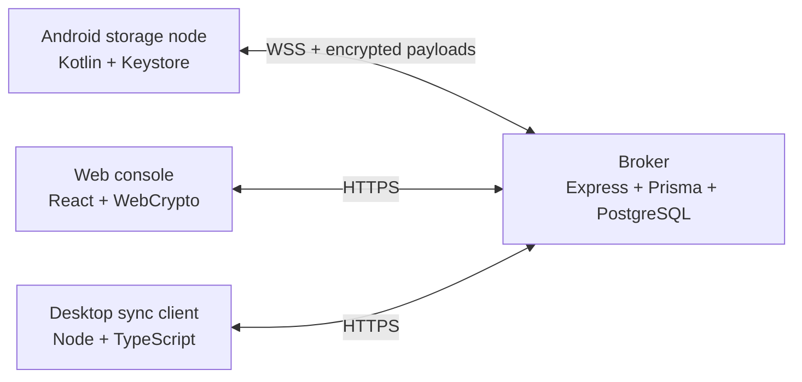

# Stashly

Stashly turns an Android phone into a remotely accessible, hardware-backed
encrypted storage node. The web console and desktop client can browse and
sync files without giving the broker a master key or plaintext file content.

## Architecture



The Android node encrypts each file with a random AES-256-GCM data encryption
key (DEK), then wraps that DEK with a device master key held by Android
Keystore. The broker stores metadata, wrapped DEKs, and opaque ciphertext only.
The browser keeps configured master keys locally and decrypts only in memory.

## Repository structure

| Directory | Purpose |
| --- | --- |
| [`stashly-android/`](./stashly-android) | Android storage node, foreground service, indexing, encryption, pairing, uploads, and Bluetooth key sharing |
| [`stashly-broker/`](./stashly-broker) | REST/WebSocket relay, authentication, scopes, sharing, MFA, audit logging, cache, and PostgreSQL schema |
| [`stashly-web/`](./stashly-web) | React dashboard, file browser, device management, offline encrypted cache, PWA assets, and settings |
| [`stashly-desktop/`](./stashly-desktop) | TypeScript CLI that synchronizes broker ciphertext into a local directory |
| [`docs/`](./docs) | Additional project documentation |

## Quick start

### Broker

```bash
cd stashly-broker
npm install
copy .env.example .env
# Set DATABASE_URL and a strong JWT_SECRET in .env
npm run prisma:migrate
npm run dev
```

The broker listens on `http://localhost:4000` by default. Production startup
uses `npm start`, which deploys migrations before launching the compiled
server. PostgreSQL is required.

### Web console

```bash
cd stashly-web
npm install
npm run dev
```

Set `VITE_BROKER_URL` when the broker is not reachable at the default
development URL. The production bundle is created with `npm run build`.

The console supports QR/manual pairing, device selection, scoped access,
live presence, encrypted previews/downloads, share-link management, dark
mode, browser notifications, offline ciphertext caching, PWA installation,
Windows WebDAV instructions, and Bluetooth master-key transfer where the
browser supports Web Bluetooth.

### Android node

1. Open `stashly-android` in Android Studio with JDK 17 and Android SDK 34.
2. Build and install with `./gradlew assembleDebug`.
3. Grant the requested storage, notification, camera, and battery-optimization
   permissions.
4. Pair from the web console by scanning its QR code or entering its code.
5. Keep the foreground storage service enabled for indexing and reconnects.

The debug build permits local HTTP broker development. Release deployments
should use HTTPS/WSS and a properly configured network security policy.

### Desktop sync client

```bash
cd stashly-desktop
npm install
npm run build
set STASHLY_BROKER_URL=http://localhost:4000
set STASHLY_TOKEN=<web-session-jwt>
set STASHLY_DEVICE_ID=<device-id>
set STASHLY_SYNC_DIR=.\stashly-sync
npm run sync
```

The client downloads encrypted broker payloads and maintains
`.stashly-manifest.json` so unchanged files are skipped. It is intended for
encrypted archival/sync workflows; it does not decrypt files.

## Security model

- Passwords are hashed and authenticated with JWTs; auth and pairing endpoints
  are rate limited and protected with security headers.
- Optional authenticator-app MFA uses TOTP. MFA secrets are encrypted at rest
  using a key derived from `JWT_SECRET`.
- Access is enforced per user/device with `ALL`, `CUSTOM_FOLDER`,
  `CUSTOM_FILE`, or `NONE` scopes and can be paused without unpairing.
- Expiring, revocable share links expose only the selected file and record
  access metadata.
- File versions, upload sessions, device telemetry, and security audit events
  are persisted by the broker without storing plaintext.
- Browser offline storage contains ciphertext and wrapped DEKs only; clearing
  browser security data removes local keys and cached ciphertext, not account
  or device records.

## License

GNU Affero General Public License v3.0 (AGPL-3.0). Copyright (C) 2026 Vedant
Kawale. See [`LICENSE`](./LICENSE).
