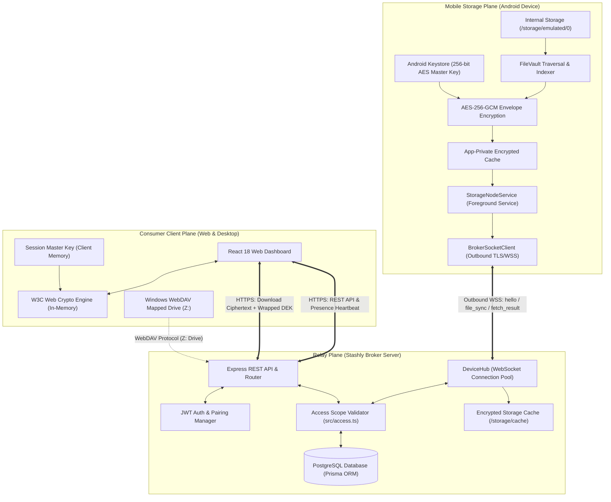
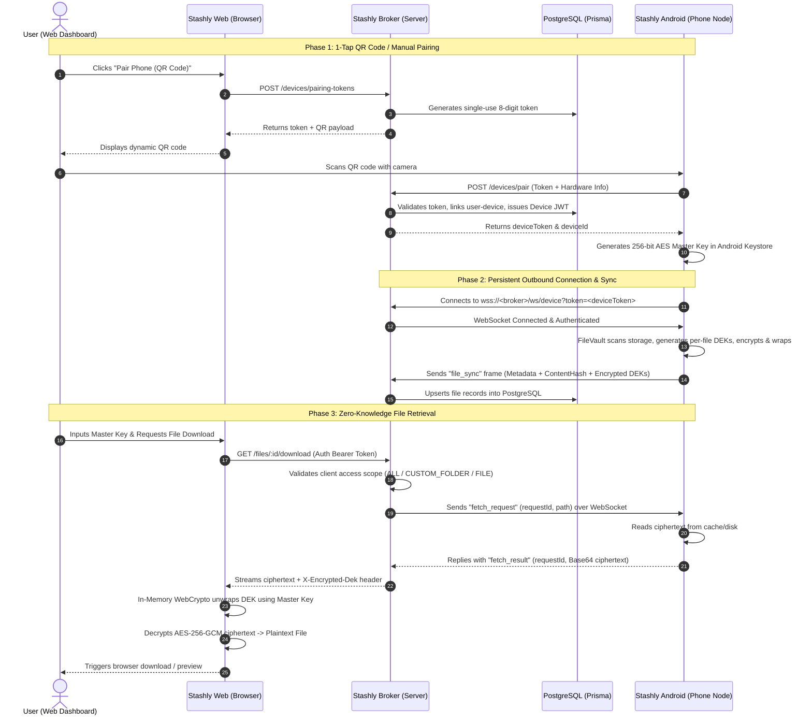

# 📦 Stashly — Decentralized Zero-Knowledge Mobile Cloud Storage

**Stashly** transforms any Android handset into an always-on, hardware-encrypted cloud storage node. Access, stream, and download files from anywhere via the Stashly Web Dashboard or Windows Network Drive without exposing unencrypted data to any third-party or relay server.

---

## 🏗️ Architecture Overview

Stashly employs a distributed, client-side zero-knowledge architecture divided into three distinct operational planes: the **Mobile Storage Plane** (`stashly-android`), the **Zero-Knowledge Relay Plane** (`stashly-broker`), and the **Consumer Client Plane** (`stashly-web` & Desktop Clients).

### System Component Diagram



---

### End-to-End Operational Lifecycle



---

## 🔒 End-to-End Encryption & Zero-Trust Boundary

| Data Type | Mobile Device (`stashly-android`) | Relay Server (`stashly-broker`) | Consumer Browser (`stashly-web`) |
| :--- | :--- | :--- | :--- |
| **Original File Content** | Accessible via OS filesystem | **Never Seen** (Strictly forbidden) | Decrypted in-memory on demand |
| **Data Encryption Keys (DEKs)** | Generated randomly per file | **Never Seen** | Decrypted in browser memory |
| **Master Key (256-bit AES)** | Stored in Android Keystore | **Never Transmitted to Broker** | Kept in local session memory |
| **Ciphertext & Wrapped DEKs** | Created & cached locally | Relayed & cached on disk | Downloaded & unwrapped |
| **File Metadata (Name, Size)** | Indexed from phone filesystem | Stored in PostgreSQL | Displayed in Vault Explorer |

---

## 📁 Repository Structure

| Directory | Description | Technology Stack |
| :--- | :--- | :--- |
| [`stashly-android/`](./stashly-android) | Android storage node background app | Kotlin, Coroutines, OkHttp, Android Keystore, ZXing |
| [`stashly-broker/`](./stashly-broker) | Real-time relay server, auth & metadata DB | Node.js, Express, TypeScript, Prisma, PostgreSQL, WS |
| [`stashly-web/`](./stashly-web) | Modern web dashboard & file explorer | React 18, TypeScript, Vite, WebCrypto, Vanilla CSS |

---

## 🚀 Quickstart Guide

### 1. Start the Broker Server (`stashly-broker`)

```bash
cd stashly-broker
npm install
cp .env.example .env

# Configure DATABASE_URL and JWT_SECRET in .env
npm run prisma:migrate
npm run dev
```
*Broker runs on `http://localhost:4000` (or your local LAN IP).*

---

### 2. Start the Web Console (`stashly-web`)

```bash
cd stashly-web
npm install
npm run dev
```
*Web dashboard runs on `http://localhost:5173`.*

---

### 3. Run the Android App (`stashly-android`)

1. Open `stashly-android` in **Android Studio** (Jellyfish or newer, JDK 17+).
2. Build and install the app onto your Android device (`API 26+` / Android 8.0+).
3. Grant **All Files Access** (Storage) and allow background activity.
4. On the **New Connection** tab, tap **📷 Scan QR Code** to scan the pairing QR code from the Web Dashboard (or enter the 8-digit code manually).
5. Choose your client file access scope (**All Storage**, **Specific Folder**, or **Specific File**).

---

## ⚡ Core Features

- **📷 1-Tap QR Auto-Pairing**: Instant discovery and secure token exchange between web dashboard and phone.
- **🌐 Full Filesystem & Scoped Access**: Expose the whole internal storage or restrict individual clients to specific folders/files.
- **⚡ Real-Time Telemetry & Status**: Live stream indicator, client presence heartbeats, last synced timestamps, and online/offline badges.
- **🛡️ Granular Access Controls**: Dynamically pause sharing or remove client connections from the Android app or web console.
- **💻 Windows Network Drive Integration**: Mount your phone's encrypted vault as a Windows mapped drive.
- **🔄 Fault-Tolerant Reconnects**: Foreground service with battery-optimization exemptions and auto-reconnect logic.

---

## 📜 License

GNU Affero General Public License v3.0 (AGPL-3.0). Copyright (C) 2026 Vedant Kawale.
See [`LICENSE`](./LICENSE) for full legal terms.
